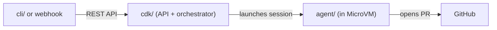

<div align="center">
  <h1>ABCA</h1>
  

  <br />
  <br />

  <strong>Autonomous Background Coding Agents on AWS</strong>

  <br />
  <br />

  <p align="center">
    
    
    
    
  </p>
</div>

---

## What is ABCA?

**ABCA (Autonomous Background Coding Agents on AWS)** is a self-hosted platform for running background coding agents in the cloud. You submit a task — a GitHub repository plus a description or issue number — and an agent works autonomously: cloning the repo, creating a branch, writing code, running tests, and opening a pull request. No human interaction during execution.

The platform is built on **AWS CDK** with a modular architecture:

- An **input gateway** normalizes requests from any channel (CLI, REST API, webhooks, Slack, Linear).
- A **durable orchestrator** drives each task through a deterministic blueprint (admission → context hydration → pre-flight → agent execution → finalization).
- **Isolated MicroVM compute environments** (AgentCore Runtime) run each agent with network-level isolation.
- A **tiered memory system** (AgentCore Memory) learns from past tasks on each repository, improving results over time.


---

## Key features

| Feature | Description |
|---------|-------------|
| **Three task types** | `new_task` (implement + PR), `pr_iteration` (address review feedback), `pr_review` (read-only structured review) |
| **Multiple input channels** | CLI, REST API, webhooks (HMAC-SHA256), Slack, Linear |
| **Durable orchestrator** | Lambda Durable Functions with checkpoint/resume; survives transient failures up to 9 hours |
| **Memory & learning** | AgentCore Memory with semantic and episodic strategies per repo — agents improve over time |
| **Security by default** | VPC isolation, DNS allowlist, Bedrock Guardrails, Cedar policy engine, WAF, output secret scanning |
| **Real-time progress** | `bgagent watch` streams live events; `bgagent nudge` sends mid-run guidance |
| **Cost controls** | Per-task turn caps, USD budget limits, and per-user concurrency limits |
| **Observability** | OpenTelemetry spans, CloudWatch dashboards, alarms, full audit trail |
| **Claude Code plugin** | Guided interactive workflows for setup, deploy, task submission, and troubleshooting |

---

## How it works

Each task follows a **blueprint** — a hybrid workflow mixing cheap deterministic steps with one expensive agentic step:

```
Admission → Context hydration → Pre-flight checks → Agent execution → Finalization
```

1. **Admission** — validates the request, checks concurrency limits, loads Blueprint config for the target repo.
2. **Context hydration** — fetches GitHub issue/PR content, loads repo memory from past tasks, assembles the full prompt (~100K token budget).
3. **Pre-flight** — verifies GitHub API reachability and repository access *before* burning compute. Fails fast with a clear reason (`GITHUB_UNREACHABLE`, `REPO_NOT_FOUND_OR_NO_ACCESS`).
4. **Agent execution** — the agent runs in an isolated MicroVM: clones the repo, creates a branch, edits code, commits, runs build/tests, opens a PR. The orchestrator polls for completion without blocking.
5. **Finalization** — infers the result, writes memory, updates task status, releases concurrency.

For a full deep-dive, see [ARCHITECTURE.md](./docs/design/ARCHITECTURE.md).

---

## Getting started

> **Fastest path:** Use the Claude Code plugin — it provides interactive guided workflows for every step below.

### Option 1 — Claude Code plugin (recommended)

```bash
git clone https://github.com/aws-samples/sample-autonomous-cloud-coding-agents.git
cd sample-autonomous-cloud-coding-agents
claude --plugin-dir docs/abca-plugin
```

Then ask Claude to `/setup`. The plugin walks you through prerequisites, deployment, PAT configuration, and your first task submission interactively.

**Available plugin skills:**

| Skill | What it does |
|-------|-------------|
| `/setup` | Full guided setup: prerequisites, toolchain, deploy, smoke test |
| `/deploy` | Deploy, diff, or destroy the CDK stack with pre-checks |
| `/onboard-repo` | Add a new GitHub repository to the platform |
| `/submit-task` | Submit a coding task with prompt quality coaching |
| `/status` | Platform health check: stack status, running tasks, build health |
| `/troubleshoot` | Diagnose deployment, auth, or task execution issues |

### Option 2 — Manual setup

**Prerequisites:** AWS account, Docker, [mise](https://mise.jdx.dev/getting-started.html), AWS CDK CLI (`npm install -g aws-cdk`).

#### 1. Clone and install

```bash
git clone https://github.com/aws-samples/sample-autonomous-cloud-coding-agents.git
cd sample-autonomous-cloud-coding-agents

mise trust && mise install
corepack enable && corepack prepare yarn@1.22.22 --activate

export MISE_EXPERIMENTAL=1
mise run install
mise run build
```

#### 2. Prepare a target repository

The agent needs a GitHub repository to work on. Fork [`awslabs/agent-plugins`](https://github.com/awslabs/agent-plugins) to get started quickly, or use your own repo.

Create a **fine-grained GitHub PAT** scoped to your repo with these permissions:

| Permission | Access |
|---|---|
| Contents | Read and write |
| Pull requests | Read and write |
| Issues | Read |
| Metadata | Read (required by GitHub) |

Register the repo in `cdk/src/stacks/agent.ts`:

```typescript
new Blueprint(this, 'MyRepoBlueprint', {
  repo: 'your-username/your-repo',
  repoTable: repoTable.table,
});
```

#### 3. Deploy

```bash
# One-time account setup for X-Ray → CloudWatch Logs
ACCOUNT_ID=$(aws sts get-caller-identity --query Account --output text)
aws logs put-resource-policy \
  --policy-name xray-spans-policy \
  --policy-document "{\"Version\":\"2012-10-17\",\"Statement\":[{\"Sid\":\"XRaySpansAccess\",\"Effect\":\"Allow\",\"Principal\":{\"Service\":\"xray.amazonaws.com\"},\"Action\":[\"logs:PutLogEvents\",\"logs:CreateLogGroup\",\"logs:CreateLogStream\"],\"Resource\":[\"arn:aws:logs:*:${ACCOUNT_ID}:log-group:aws/spans\",\"arn:aws:logs:*:${ACCOUNT_ID}:log-group:aws/spans:*\"]}]}"
aws xray update-trace-segment-destination --destination CloudWatchLogs

# Bootstrap (first time only)
MISE_EXPERIMENTAL=1 mise run //cdk:bootstrap

# Deploy (~10 minutes)
MISE_EXPERIMENTAL=1 mise run //cdk:deploy
```

#### 4. Configure the CLI and submit your first task

```bash
# Get stack outputs
REGION=<your-region>
API_URL=$(aws cloudformation describe-stacks --stack-name backgroundagent-dev \
  --region "$REGION" --query 'Stacks[0].Outputs[?OutputKey==`ApiUrl`].OutputValue' --output text)
USER_POOL_ID=$(aws cloudformation describe-stacks --stack-name backgroundagent-dev \
  --region "$REGION" --query 'Stacks[0].Outputs[?OutputKey==`UserPoolId`].OutputValue' --output text)
APP_CLIENT_ID=$(aws cloudformation describe-stacks --stack-name backgroundagent-dev \
  --region "$REGION" --query 'Stacks[0].Outputs[?OutputKey==`AppClientId`].OutputValue' --output text)

# Store your GitHub PAT
GITHUB_TOKEN_SECRET=$(aws cloudformation describe-stacks --stack-name backgroundagent-dev \
  --region "$REGION" --query 'Stacks[0].Outputs[?OutputKey==`GitHubTokenSecretArn`].OutputValue' --output text)
aws secretsmanager put-secret-value \
  --secret-id "$GITHUB_TOKEN_SECRET" --region "$REGION" \
  --secret-string '{"github_token":"ghp_YOUR_TOKEN_HERE"}'

# Configure the CLI
cd cli && mise run build && cd ..
bgagent configure --api-url "$API_URL" --user-pool-id "$USER_POOL_ID" \
  --client-id "$APP_CLIENT_ID" --region "$REGION"

# Log in (create a Cognito user first via AWS Console or CLI)
bgagent login

# Submit a task
bgagent submit --repo your-username/your-repo \
  --task "Add input validation to the POST /users endpoint"

# Watch live progress
bgagent watch <task-id>
```

For a full walkthrough, see the [Quick Start guide](./docs/guides/QUICK_START.md).

---

## CLI reference

The `bgagent` CLI is the primary interface for submitting and managing tasks.

```
bgagent <command> [options]

Commands:
  configure   Save API URL and Cognito identifiers
  login       Authenticate via Cognito (caches token)
  submit      Submit a new coding task
  list        List tasks (optionally filter by status/repo)
  status      Get task details and current status
  watch       Stream live progress events for a running task
  nudge       Send mid-run guidance to a running agent
  cancel      Cancel a running task
  events      List audit events for a task
  trace       Download a full execution trace (requires --trace on submit)
  webhooks    Manage webhook integrations (create, list, revoke)
```

**Common options:**

```bash
# Submit with optional extras
bgagent submit \
  --repo owner/repo \
  --task "Fix the login regression" \
  --issue 42 \               # pull issue context from GitHub
  --type pr_iteration \      # default: new_task
  --max-turns 50 \
  --budget 5.00 \
  --trace                    # upload full trajectory to S3

# Watch with auto-exit on terminal state
bgagent watch <task-id>

# Send guidance to a running agent
bgagent nudge <task-id> "Focus only on the authentication module"
```

---

## Repository structure

```
sample-autonomous-cloud-coding-agents/
├── cdk/        # Infrastructure and REST API (TypeScript, AWS CDK)
├── agent/      # Agent runtime inside the MicroVM (Python, Docker)
├── cli/        # bgagent CLI client (TypeScript, commander)
├── docs/       # Documentation site (Astro/Starlight) + Claude Code plugin
├── mise.toml   # Monorepo task runner
└── package.json
```

A task flows through these packages in order: the **CLI** (or webhook) calls the **CDK**-deployed API → the orchestrator Lambda prepares the task and launches an **agent** session → the agent works autonomously until it opens a PR.



---

## Cost model

The dominant cost is Bedrock inference and AgentCore compute — not AWS infrastructure.

| Scale | Tasks/month | Estimated monthly cost |
|---|---|---|
| Low (1 developer) | 30–60 | $150–$500 |
| Medium (small team) | 200–500 | $500–$3,000 |
| High (org-wide) | 2,000–5,000 | $5,000–$30,000 |

Use `--max-turns` and `--budget` on task submission to control per-task costs. See [COST_MODEL.md](./docs/design/COST_MODEL.md) for the full breakdown.

---

## Documentation

Full documentation is available at **[https://aws-samples.github.io/sample-autonomous-cloud-coding-agents/](https://aws-samples.github.io/sample-autonomous-cloud-coding-agents/)**.

| Guide | Description |
|---|---|
| [Quick Start](./docs/guides/QUICK_START.md) | Zero to first PR in ~30 minutes |
| [Developer Guide](./docs/guides/DEVELOPER_GUIDE.md) | Environment setup, local testing, development workflow |
| [User Guide](./docs/guides/USER_GUIDE.md) | All input channels, CLI reference, webhooks, Slack, Linear |
| [Prompt Guide](./docs/guides/PROMPT_GUIDE.md) | Writing effective tasks, anti-patterns, examples |
| [Architecture](./docs/design/ARCHITECTURE.md) | System design, components, design principles |
| [Roadmap](./docs/guides/ROADMAP.md) | What's shipped and what's coming next |

---

## Contributing

See [CONTRIBUTING.md](./CONTRIBUTING.md) for guidelines. Contributions are welcome — bug reports, feature requests, and pull requests all appreciated.

Key conventions:
- Use **[AGENTS.md](./AGENTS.md)** to understand where to make changes (CDK vs CLI vs agent vs docs).
- Commit messages follow [Conventional Commits](https://www.conventionalcommits.org): `feat(module): description`.
- Run `mise run build` before submitting — CI requires a clean build, passing tests, and up-to-date generated docs.

---

## Disclaimer

This repository is for experimental and educational purposes only. It demonstrates concepts and techniques but is not intended for direct use in production environments without review and hardening.

## License

This library is licensed under the MIT-0 License. See the [LICENSE](./LICENSE) file.
